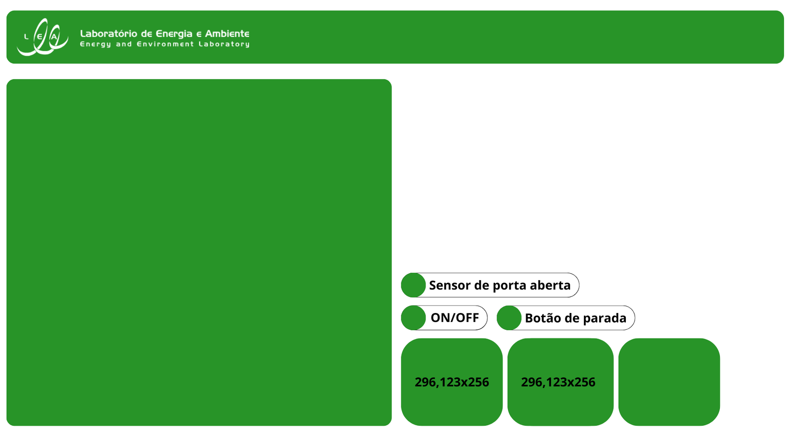

# 1 Configuração da Interface

## 1.1 Ideia por de trás dos Painéis

Os painéis do túnel de vento e de água foram criados com a intuição de poder dividir a tela em duas abas sem prejudicar a operação do túnel.

As imagens têm as dimensões **1900x900**.

### 1.1.1 Painel do Túnel de Vento

Foi projetado para que no lado esquerdo encontre-se o gráfico de velocidade e na parte direita:

- Indicador de porta aberta;
- Indicador de pressionamento do botão de parada;
- Botão de ligar e desligar o túnel;

além de espaço para visualização gráfica e escrita da temperatura, da velocidade e da pressão no interior do túnel, todos instantâneos.

***Obs.: A visualização gráfica e escrita instantânea obtida são mostrados por meio da biblioteca [Fusca Br](https://github.com/celsou/fuscabr) que é utilizada nos softwares SCADA LTS e BR para elaboração de representações gráficas mais complexas ***

