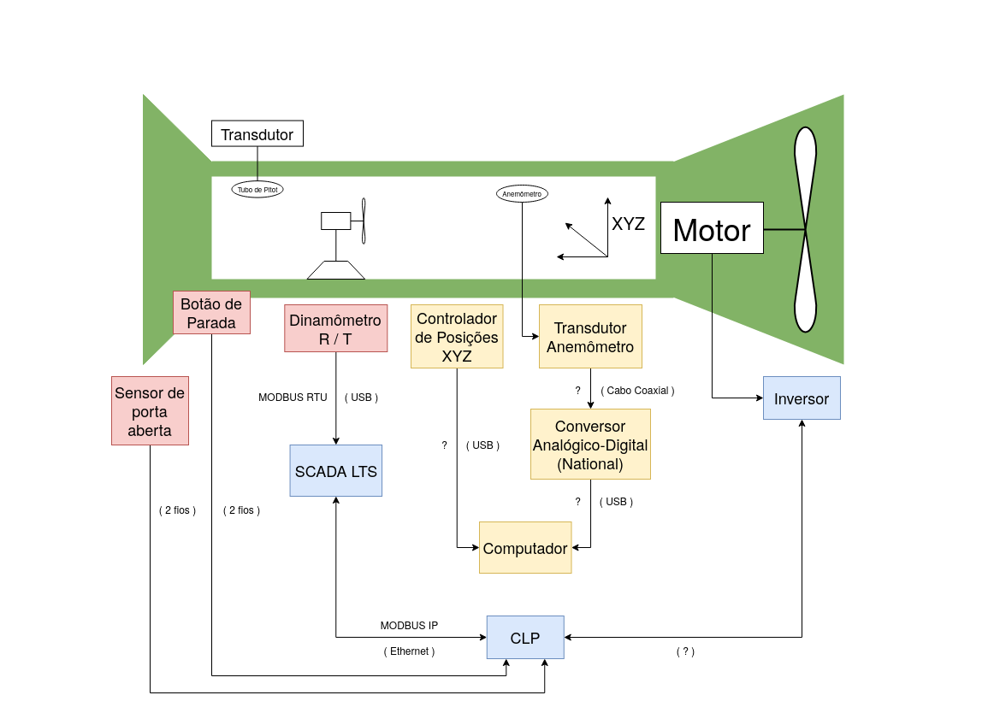
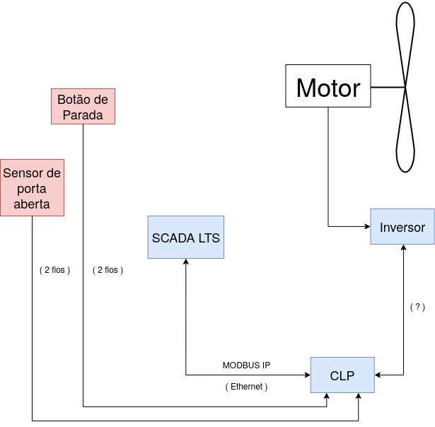
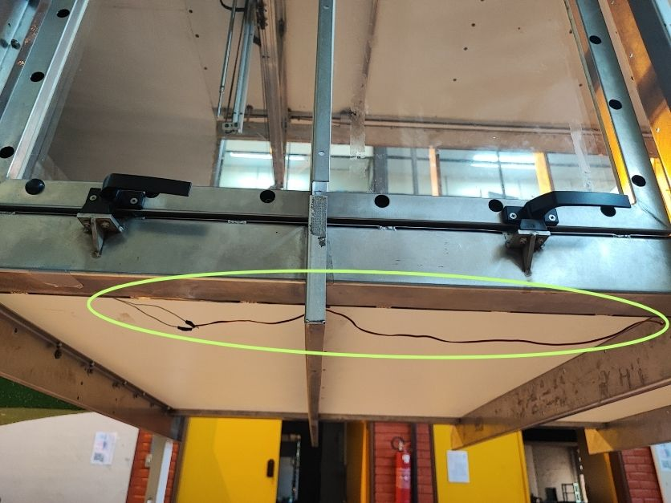
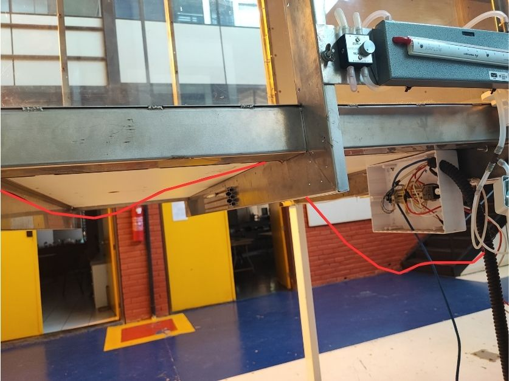

# Turbina túnel de vento

# 1. Apresentação

O túnel de vento localizado no Laboratório de Energia e Ambiente (LEA) da Universidade de Brasília foi projetado para ser utilizado em testes de desempenho e análise de escoamentos e aerodinâmicos em turbinas hidrocinéticas e eólicas, asas de avião e aerofólios, etc. e usa instrumentação específica e um sistema de aquisição de dados e controle para disponibilizar e organizar os dados medidos.

___
# 2. Diagrama do Túnel

O esquemático a seguir representa os sistemas do túnel de vento. Nele podemos perceber três principais sistemas. Na cor amarela, o sistema de controle e aquisição de dados do anemômetro de fio quente. Na cor azul, o sistema de controle do túnel de vento, e em vermelho, os sensores e o controlador da turbina que realiza-se os testes.

O sistema do tubo de pitot se encontra presente no túnel mas apenas pode ser utilizado de forma analógica, sem poder visualizar as informações coletadas no computador, apenas no medidor analógico localizado próximo ao Scada LTS.

# 3. Os Sistemas do Túnel

Atualmente no túnel de vento existem alguns sistemas para obter dados importantes para os estudos realizados nele. São eles:

## 3.1 Tubo de Pitot

Mecanismo para encontrar a velocidade de escoamento de um fluido que se baseia na diferença entre a pressão dinâmica do mesmo e a do ambiente. São bastante utilizados na aviação.

Por meio da manipulação da equação de Bernoulli, chega-se à
$$v=\sqrt{\frac{2(p_e-p_d)}{\rho}}$$
onde $v$ é a velocidade do fluido, $\rho$ a densidade do ar, $p_e$ pressão de estagnação e $p_d$ pressão dinâmica. Esse valor de $v$ serve de parâmetro para os experimentos.

A explicação de como o tubo de pitot está instalado se encontra dentro da pasta **Sistemas do Túnel de Vento** com o nome [Tubo de Pitot.md](./Sistemas_Túnel_Vento/Tubo%20de%20Pitot.md).

Atualmente, esse sistema não está conectado ao computador, permitindo apenas a utilização dos dados que são obtidos de forma analógica.

## 3.2 Controle do Túnel de Vento

O controle do túnel e realizado por meio de um motor síncrono, um inversor, um CLP e um sistema de SCADA (*Supervisory Control and Data Aquisition*, em inglês), além de um sensor de porta aberta e um botão de parada.

### 3.2.1 Motor Síncrono

### 3.2.2 Inversor

O inversor utilizado é o [CFW 09](Manuais/inversor.pdf) da empresa WEG.
 
### 3.2.3 CLP

O Controlador Lógico Programável (PLC na sigla em inglês) utilizado é o [S7 1200](Manuais/s71200_system_manual_en-US_en-US.pdf) da marca Siemens.

### 3.2.4 SCADA

O Sistema Supervisório de Controle e Aquisição de Dados (SCADA, na sigla em inglês) utilizado é o [SCADA LTS](https://github.com/SCADA-LTS/Scada-LTS), um software de código aberto desenvolvido na base do [Scada BR](https://scadabr.org/) que é um software desenvovlido no Brasil.

Atualmente é o responsável por controlar da velocidade do vento e informar os valores de pressão e temperatura no interior do túnel.

### 3.2.5 Sensor de porta aberta

Um sensor de continuidade composto por dois fios, onde um fica conectado na parte móvel da porta do túnel e o outro na parte fixa da estrutura. Quando fechada a porta, fecha-se o circuito e assim o sistema supervisório sabe que pode ligar o túnel.

Ambos fios passam juntos por de baixo do túnel de vento até a caixa de conexão

Dentro da caixa de conexão, ambos fios seguem juntos até o CLP, antes de chegarem ao sistema SCADA.

### 3.2.6 Botão de parada

## 3.3 Controle do Anemômetro de Fio Quente

___
# 4. Controle de rotação da turbina eólica 

Programa para fazer o ensaio de uma turbina eolica num túnel de vento aplicando carga e medindo torque e rotação

O programa implementa o controle de velocidade da turbina por meio de um algoritmo PID tendo como entrada o setpoint de referência e acionando uma carga elétrica ligada na saída do gerador da turbina.

Os valores de velocidade, torque, erro e sinal de controle do PWM são disponibilizados pelo protocolo ModBus Serial, assim como o valor do referência (setpoint).

Protocolo ModBus Serial ASCII. 
Configuração da porta serial 9600 bps, 8N1.

Endereço da placa ModBus = 1 e os registradores são:

| Registrador  | Endereço | variável    | tipo                                           |          range          |
| ------------ | :------: | ----------- | ---------------------------------------------- | :---------------------: |
| Entrada      |    1     | velocidade  | inteiro 2 bytes sem sinal                      |         0-65535         |
| Entrada      |    2     | torque      | inteiro 2 bytes com sinal dividir por 100      |    -327,67 a +327,67    |
| Entrada      |    3     | erro        | inteiro 2 bytes com sinal dividir por 100      |    -327,67 a +327,67    |
| Entrada      |    4     | control_pwm | inteiro 2 bytes sem sinal                      |         0-65535         |
| Holding      |    10    | setpoint    | inteiro 2 bytes sem sinal                      |         0-65535         |
| Holding      |    11    | ganho       | inteiro 2 bytes sem sinal multiplicado por 100 |    -327,67 a +327,67    |
| Holding      |    12    | offset      | inteiro 2 bytes sem sinal multiplicado por 100 |    -327,67 a +327,67    |
| Coil stattus |    1     | calibracao  | bit                                            | 0 normal / 1 calibrando |

Para gravar os dados de calibração é necessário mandar os dados de granho e offset via modbus para a placa e depois ligar e desligar o coil calibração.

