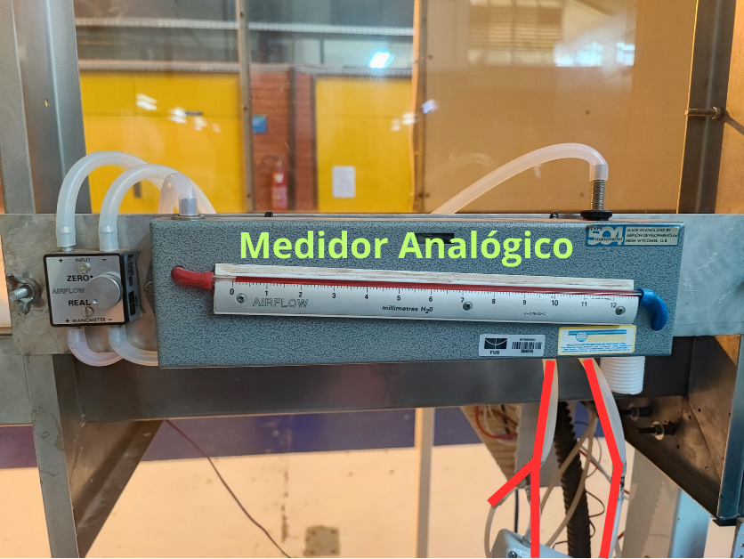

# 1 Tubo de Pitot

Mecanismo para encontrar a velocidade de escoamento de um fluido que se baseia na diferença entre a pressão dinâmica do mesmo e a do ambiente. São bastante utilizados na aviação.

Por meio da manipulação da equação de Bernoulli, chega-se à
$v=\sqrt{\frac{2(p_e-p_d)}{\rho}}$ onde $v$ é a velocidade do fluido, $\rho$ a densidade do ar, $p_e$ pressão de estagnação e $p_d$ pressão dinâmica. Esse valor de $v$ serve de parâmetro para os experimentos.

## 1.1 Esquemático na turbina

O esquemático do tubo de pitot é representado pelo seguintes elementos do diagrama de blocos:

Onde o tubo de pitot é o elemento presente no interior do túnel e o transdutor o resumo da instalação *in loco* e dos medidores analógico e eletrônico, conforme explicado no sub-tópico seguinte.

## 1.2 Instalação *in loco*

No túnel, o tubo de pitot se localiza no canto superior esquerdo de quem abre a porta, próximo do acrílico transparente ao fundo.

A tubulação que sai do tubo passa pela parte superior do túnel, descendo pelas canaletas verticais.

Com o tubo na parte inferior do túnel, o mesmo passa por de trás da caixa de conexão antes de chegar à um medidor analógico instalado paralelamente à um medidor eletrônico que envia informações coletadas para o sistema SCADA do túnel.

Com esses medidores, quem realiza o ensaio pode ver em redundância a informação que chega, permitindo uma calibração mais precisa dos equipamentos e uma maior confiabilidade no que está sendo medido.

Atualmente, esses sistema não está conectado ao computador, permitindo apenas a utilização dos dados que são obtidos de forma analógica.