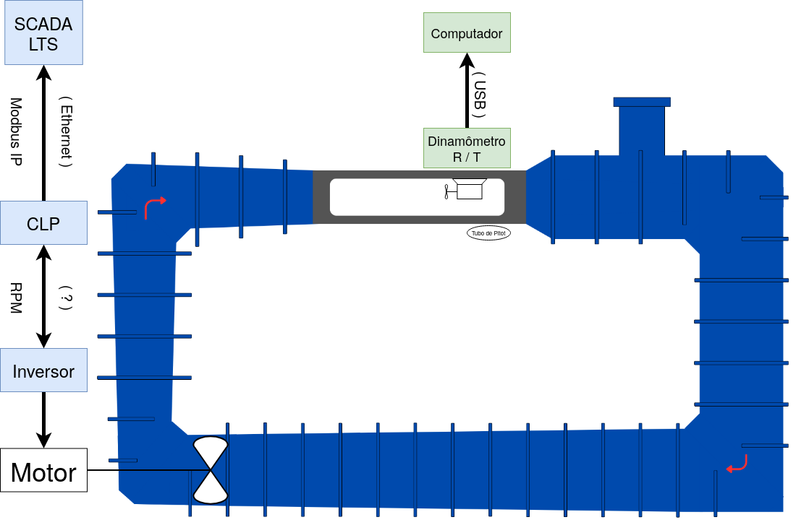

# Túnel de Água

# 1. Apresentação

O túnel de água foi projetado para ser utilizado em testes de desempenho e análise de escoamentos e aerodinâmcios em turbinas hidrocinéticas e usa a instrumentação específica e um sistema de aquisição de dados e controle para disponibilizar e organizar os dados medidos.

___

# 2. Diagrama do Túnel

O esquemático a seguir representa os sistemas do túnel de água. Nele podemos perceber dois principais sistemas. Na cor azul, o sistema de controle do túnel de água (que também controla o [Túnel de vento](../Túnel%20de%20Vento/Túnel%20de%20vento.md)), e em verde, os sensores e o controlador da turbina que realizam-se os testes.

O sistema do tubo de pitot se encontra presente no túnel mas não é utilizado uma vez que suas informações fornecidas não podem ser consideradas por estar instalado em uma posição que a medição não é válida.

___

# 3. Os Sistemas do Túnel

## 3.1 Controle do Túnel de Água

O controle do túnel e realizado por meio de um motor síncrono, um inversor, um CLP e um sistema de SCADA (*Supervisory Control and Data Aquisition*, em inglês), além de um sensor de porta aberta e um botão de parada.

A explicação de cada um dos componentes do sistema de controle junto com a representação do sistema no diagrama de blocos se encontra na pasta **Sistemas do Túnel de Água** com o nome [Controle do Túnel de Água.md](./Sistemas/Controle%20do%20Túnel%20de%20Água.md).

___

# 4. Experimentos do Túnel de Água

## 4.1 Turbina Hidrocinética

