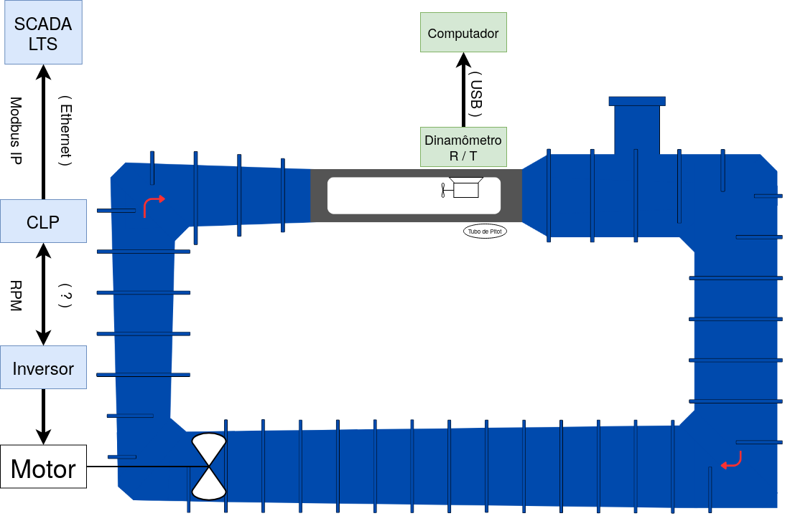
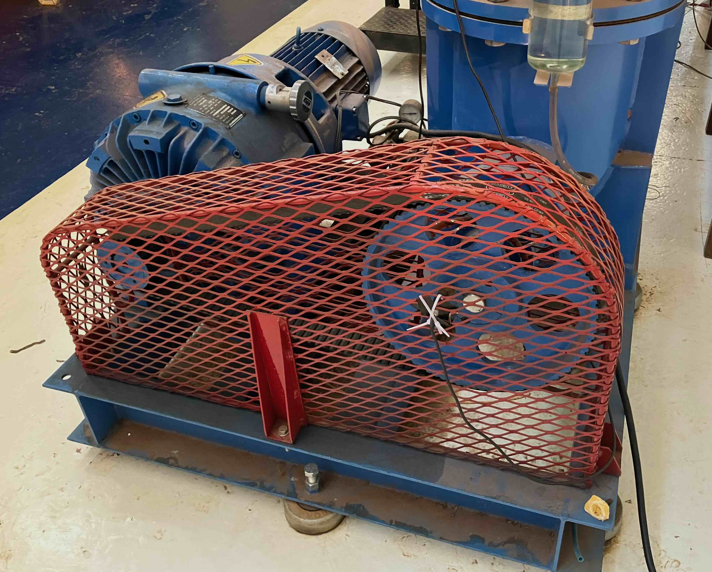
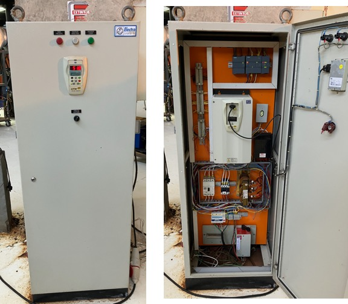
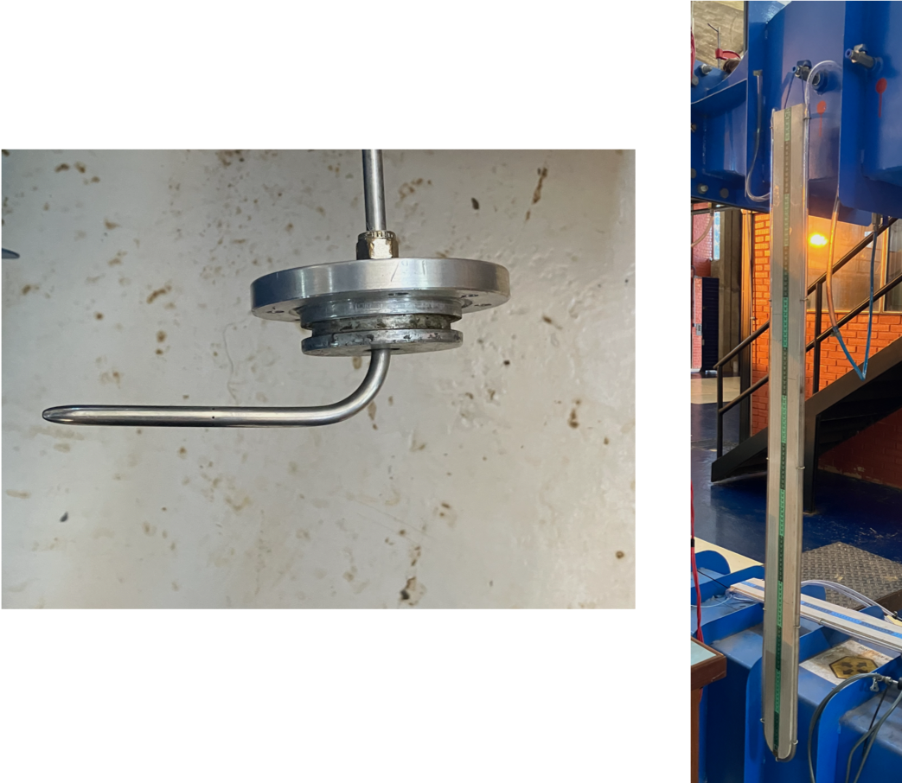

# Túnel de Água

Apresentação

O túnel de água foi projetado para ser utilizado em testes de desempenho e análise de escoamentos e aerodinâmcios em turbinas hidrocinéticas e usa a instrumentação específica e um sistema de aquisição de dados e controle para disponibilizar e organizar os dados medidos.

Figura 1. Foto do túnel de água
___

A Figura 1.2 apresenta o diagrama de blocos com os sistemas do túnel de água. Nele podemos perceber dois principais sistemas. Na cor azul, o sistema de controle do túnel de água e em verde, os sensores e o controlador da turbina que realizam-se os testes.

Sistema de acionamento e controle do túnel (azul)

* CLP
* Inversor

Sistema de instrumentação, controle e aquisição de dados dos ensaios (verde)

* Dinamômetro turbina (rotação e torque)
* Tubo de pitot

Sistema supervisório
 
* ScadaLTS

Figura 1.
___

Os dois sistemas permitem a realiazção de diversos experimentos. Cada experimento é montada conforma a sua necessidade. 
A seguir os tipos de experimentos mais usados são listados: 

* Ensaios de turbinas hidrocinética de eixo horizontal com dinamômetro
* Ensaios de avaliação de escoamento
* Ensaios .....

## 1. Sistemas de acionamento e controle do motor do túnel de água 

A bomba do túnel de água é acionado por um motor de indução que por sua vez é controlado por um inversor. O mesmo inversor usado no túnel de vento também é usado para o acionamento e controle do túnel de vento.
A Figura 1.1 mostra o conjunto motobomba instalado no túnel de água.

___

### 1.1 Inversor

O inversor utilizado é o [CFW 09](../Manuais/inversor.pdf) da empresa WEG.

Figura 1.1. Quadro de comando com inversor
___

Por dividir o mesmo inversor com o túnel de vento, antes de utilizar o túnel de água, deve-se atentar para alguns parâmetros do inversor que precisam ser conferidos e possivelmente alterados. Os parâmetros que devem ser selecionados e os valores que devem estar aparecendo são os seguintes:

| Parâmetros | Valores |   Unidades    |
|------------|:-------:|---------------|
|    P401    |  13,5   | Corrente (A)  |
|    P402    |  1080   | Rotação  (RPM)|
|    P404    |   7,5   | Potência (cv) |

O procedimento para trocar os paramtros é descrito [neste tutorial.]() 
 
### 1.2 CLP

O Controlador Lógico Programável (PLC na sigla em inglês) utilizado é o [S7 1200](../Manuais/s71200_system_manual_en-US_en-US.pdf) da marca Siemens.

## 2. Sistema de instrumentação, controle e aquisição de dados dos ensaios

Os principais equipamentos no túnel de vento usados para fazer os diversos tipos de ensaios são os instrumentos para fazer medição de velocidade do escoamento e um dinamômetro que é usado para testar diversos tipos de hélices de turbinas turbinas hidrocinéticas.

Os principais equipamentos são: 

* Manometro
* Tubo de pitot
* Dinamômetro turbina hidrocinética(rotação e torque)

### 2.1. Instrumentação 

Figura 2.1. Manometro e tubo de pitot
___

### 2.2. Dinamômetro (turbina hidrocinética)

O dinamômetro de hélices, aqui também chamada de turbina hidrocinética, é um equipamento usado para ensaiar hélices de turbinas hidrocinéticas no túnel de água, capaz de monitorar a rotação da hélice e o torque gerado pelo hélice, quando submetido a um escoamento. 

Além disso, o equipamento é capaz aplicar uma carga no eixo mecânico da hélice e dessa forma fazer o levantamento da característica da curva de torque da hélice. 

O equipamento foi desenvolvido no LEA e já deu suporte a diversas pesquisas de graduação e pos-graduação (refenciar os tcc, dissertaçoes e teses).

---
# 3. Experimentos do Túnel de Água

## 3.1. Procedimento de calibração

## 3.2. Turbina Hidrocinética

