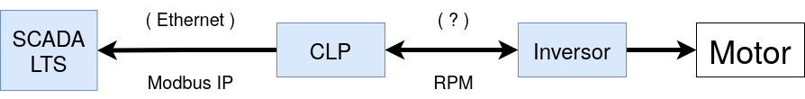

# 1. Controle do Túnel de Água

O controle do túnel e realizado por meio de um motor síncrono, um inversor, um CLP e um sistema de SCADA (*Supervisory Control and Data Aquisition*, em inglês).

## 1.1 Motor Síncrono

## 1.2 Inversor

O inversor utilizado é o [CFW 09](../Manuais/inversor.pdf) da empresa WEG.

### 1.2.1 Parametrizações

Por dividir o mesmo inversor com o túnel de vento, antes de utilizar o túnel de água, deve-se atentar para alguns parâmetros do inversor que precisam ser conferidos e possivelmente alterados. Os parâmetros que devem ser selecionados e os valores que devem estar aparecendo são os seguintes:

| Parâmetros | Valores |   Unidades    |
|------------|---------|---------------|
|    P401    |  13,5   | Corrente (A)  |
|    P402    |  1080   | Rotação  (RPM)|
|    P404    |   7,5   | Potência (cv) |
 
## 1.3 CLP

O Controlador Lógico Programável (PLC na sigla em inglês) utilizado é o [S7 1200](../Manuais/s71200_system_manual_en-US_en-US.pdf) da marca Siemens.

## 1.4 SCADA

O Sistema Supervisório de Controle e Aquisição de Dados (SCADA, na sigla em inglês) utilizado é o [SCADA LTS](https://github.com/SCADA-LTS/Scada-LTS), um software de código aberto desenvolvido na base do [Scada BR](https://scadabr.org/) que é um software desenvovlido no Brasil.

Atualmente é o responsável por controlar da velocidade da água no interior do túnel.

> Diferente do [Controle do Túnel de Vento](../../Túnel%20de%20Vento/Sistemas/Controle%20do%20Túnel%20de%20Vento.md), no túnel de água o controle é realizado apenas por esses quatro equipamentos, mesmo que os dois compartilhem o inversor, o CLP e o SCADA.