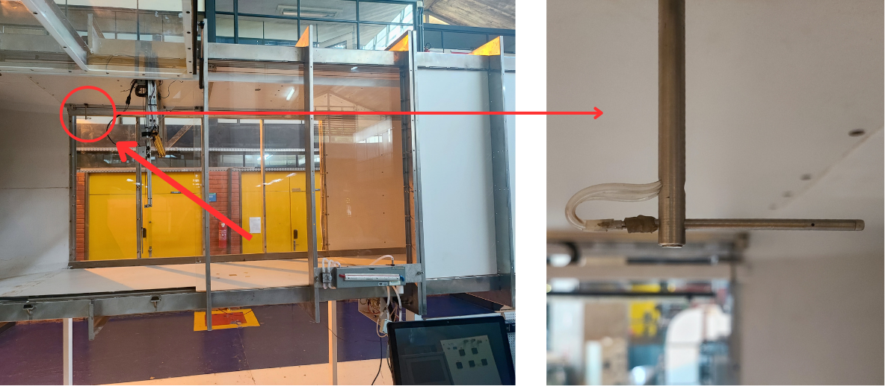

# 1. Túnel de vento

Apresentação

O túnel de vento localizado no Laboratório de Energia e Ambiente (LEA) da Universidade de Brasília foi projetado para ser utilizado em testes de desempenho e análise de escoamentos e aerodinâmicos em turbinas hidrocinéticas e eólicas, asas de avião e aerofólios, etc. e usa instrumentação específica e um sistema de aquisição de dados e controle para disponibilizar e organizar os dados medidos.

Figura 1.1 Foto do túnel de vento
___

A Figura 1.2 representa o diagama de blocos do túnel de vento. Nele podemos perceber três principais sistemas. Na cor amarela, o sistema de controle e aquisição de dados do anemômetro de fio quente. Na cor azul, o sistema de controle do túnel de vento (que também controla o [Túnel de água](../tunel_de_agua/Readme.md)), e em vermelho, os sensores e o controlador da turbina que realizam-se os testes.

Sistema de acionamento e controle do túnel (azul/vermelho)

* Scada
* CLP
* Inversor

Sistema de instrumentação, controle e aquisição de dados dos ensaios (amarelo)

* Controlador de posição XYZ
* Transdutor anemômetro
* Dinamômetro turbina (rotação e torque)
* Tubo de pitot

Figura 1.2. Diagrama de blocos do túnel de vento
___

Os dois sistemas permitem a realiazção de diversos experimentos. Cada experimento é montada conforma a sua necessidade. 
A seguir os tipos de experimentos mais usados são listados: 

* Ensaios de turbinas de eixo horizontal com dinamômetro
* Ensaios de avaliação de escoamento com anemômetro e posicionador XYZ
* Ensaios .....

## 1.1. Sistemas de acionamento e controle do túnel 

Especificação do motor de indução.

O controle do túnel e realizado por meio de um motor assíncrono, um inversor, um CLP e um sistema de SCADA (*Supervisory Control and Data Aquisition*, em inglês), além de um sensor de porta aberta e um botão de parada.

Figura 1.1.1. Diagrama blocos controle túnel

___
### 1.1.1. Inversor

O inversor utilizado é o [CFW 09](./Manuais/inversor.pdf) da empresa WEG.

***Parametrizações***

Por dividir o mesmo inversor com o túnel de água, antes de utilizar o túnel de vento, deve-se atentar para alguns parâmetros do inversor que precisam ser conferidos e possivelmente alterados. Os parâmetros que devem ser selecionados e os valores que devem estar aparecendo são os seguintes:

| Parâmetros | Valores |   Unidades    |
|------------|---------|---------------|
|    P401    |  21,8   | Corrente (A)  |
|    P402    |  1760   | Rotação  (RPM)|
|    P404    |  12,5   | Potência (cv) |

 
### 1.1.2. CLP

O Controlador Lógico Programável (PLC na sigla em inglês) utilizado é o [S7 1200](../Manuais/s71200_system_manual_en-US_en-US.pdf) da marca Siemens.

***Proteção***

Um sensor de continuidade composto por dois fios, onde um fica conectado na parte móvel da porta do túnel e o outro na parte fixa da estrutura. Quando fechada a porta, fecha-se o circuito e assim o sistema supervisório sabe que pode ligar o túnel.

[sensor de avertura porta](./Imagens/sensor_porta.jpg)

Ambos fios passam juntos por de baixo do túnel de vento até a caixa de conexão

Dentro da caixa de conexão, ambos fios seguem juntos até o CLP, antes de chegarem ao sistema SCADA.

***Botão de parada***

### 1.1.3. Scada 
O controle do túnel e realizado por meio de um motor síncrono, um inversor, um CLP e um sistema de SCADA (*Supervisory Control and Data Aquisition*, em inglês), além de um sensor de porta aberta e um botão de parada.

A explicação de cada um dos componentes do sistema de controle junto com a representação do sistema no diagrama de blocos se encontra na pasta **Sistemas do Túnel de Vento** com o nome [Controle do Túnel de Vento.md](./Sistemas/Controle%20do%20Túnel%20de%20Vento.md).

O Sistema Supervisório de Controle e Aquisição de Dados (SCADA, na sigla em inglês) utilizado é o [SCADA LTS](https://github.com/SCADA-LTS/Scada-LTS), um software de código aberto desenvolvido na base do [Scada BR](https://scadabr.org/) que é um software desenvovlido no Brasil.

Atualmente é o responsável por controlar da velocidade do vento e informar os valores de pressão e temperatura no interior do túnel.

## 1.2. Sistema de instrumentação, controle e aquisição de dados dos ensaios

Descrição do hardware e funcionamento. 

* Controlador de posição XYZ
* Transdutor anemômetro
* Dinamômetro turbina (rotação e torque)
* Tubo de pitot

### 1.2.1 Controlador de posição XYZ

### 1.2.2 Transdutor anemômetro

### 1.2.3 Dinamômetro turbina (rotação e torque)

### 1.2.4. Tubo de Pitot

O sistema do tubo de pitot se encontra presente no túnel mas apenas pode ser utilizado de forma analógica, sem poder visualizar as informações coletadas no computador, apenas no medidor analógico localizado próximo ao Scada LTS.

Mecanismo para encontrar a velocidade de escoamento de um fluido que se baseia na diferença entre a pressão dinâmica do mesmo e a do ambiente. São bastante utilizados na aviação.

Figura 1.2.4.1. Local de instalação do turbo de pitot 
___

A explicação de como o tubo de pitot está instalado e a representação no diagrama de blocos se encontra dentro da pasta **Sistemas do Túnel de Vento** com o nome [Tubo de Pitot.md](./Sistemas/Tubo%20de%20Pitot.md).

Figura 1.2.4.x. Medidor analógico
___
Atualmente, esse sistema não está conectado ao computador, permitindo apenas a utilização dos dados que são obtidos de forma analógica.

## 1.3. Experimentos no Túnel de Vento

Descrição dos experimentos.

* Ensaios de turbinas de eixo horizontal com dinamômetro
* Ensaios de avaliação de escoamento com anemômetro e posicionador XYZ
* Ensaios .....

### 1.3.1 Experimento da Turbina de Eixo Horizontal

Utiliza-se um modelo reduzido de uma turbina de eixo vertical para realizar experimentos relacionados ao torque estático do rotor.

O material, o esquemático de funcionamento e como é feita a configuração dos componentes, assim como a calibração do mesmo, se encontram na pasta **Experimentos** com o nome [Turbina de Eixo Horizontal.md](./Experimentos/Turbina%20de%20Eixo%20Horizontal.md)

### 1.3.2 Ensaio com Anemômetro de Fio Quente
___