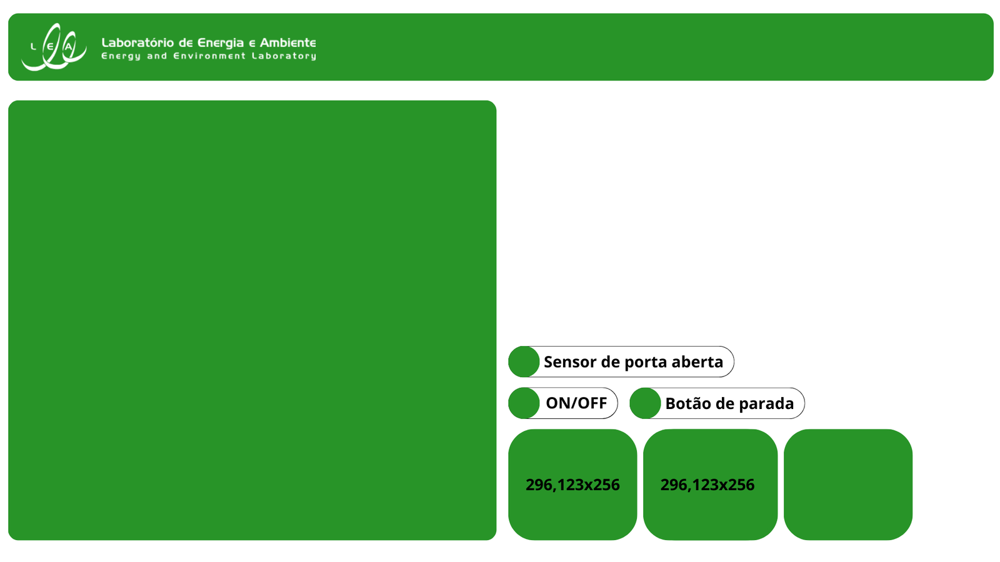

#Túnel de vento

Apresentação

O túnel de vento localizado no Laboratório de Energia e Ambiente (LEA) da Universidade de Brasília foi projetado para ser utilizado em testes de desempenho e análise de escoamentos e aerodinâmicos em turbinas hidrocinéticas e eólicas, asas de avião e aerofólios, etc. e usa instrumentação específica e um sistema de aquisição de dados e controle para disponibilizar e organizar os dados medidos.

Figura 1. Foto do túnel de vento
___

A Figura 1.2 representa o diagama de blocos do túnel de vento. Nele podemos perceber três principais sistemas. Na cor amarela, o sistema de controle e aquisição de dados do anemômetro de fio quente. Na cor azul, o sistema de controle do túnel de vento (que também controla o [Túnel de água](../tunel_de_agua/Readme.md)), e em vermelho, os sensores e o controlador da turbina que realizam-se os testes.

Sistema de acionamento e controle do túnel (azul/vermelho)

* CLP
* Inversor

Sistema de instrumentação, controle e aquisição de dados dos ensaios (amarelo)

* Dinamômetro turbina (rotação e torque)
* Controlador de posição XYZ
* Transdutor anemômetro
* Tubo de pitot

Sistema supervisório
 
* ScadaLTS

Figura 2. Diagrama de blocos do túnel de vento
___

Os dois sistemas permitem a realiazção de diversos experimentos. Cada experimento é montada conforma a sua necessidade. 
A seguir os tipos de experimentos mais usados são listados: 

* Ensaios de turbinas de eixo horizontal com dinamômetro
* Ensaios de avaliação de escoamento com anemômetro e posicionador XYZ
* Ensaios .....

## 1. Sistemas de acionamento e controle do túnel 

O controle de velocidade do vento no túnel e realizado por meio de um motor assíncrono, um inversor, um CLP e um sistema de SCADA (*Supervisory Control and Data Aquisition*, em inglês), além de um sensor de porta aberta e um botão de parada.

Figura 1.1. Diagrama blocos controle túnel

___

O motor de indução que aciona a hélice do túnel de vento tem capacidade de xx HP. Ele é acionado por meio de um inversor de WG modelo CFW 09 alojado num quadro de comando, junto com um controlador lógico programável CLP da Siemens modelo XXX. 

Todos os comandos para acionar o motor ou ler algumas varíaveis do motor passam pelo CLP. 
A comunicação entre o CLP e o Inversor CFW9 está documento neste [trabalho de conclusão de curso.]() que implementou a primeira versão do controlador. 

### 1.1. Inversor

O inversor utilizado é o [CFW 09](./Manuais/inversor.pdf) da empresa WEG.

***Parametrizações***

Por dividir o mesmo inversor com o túnel de água, antes de utilizar o túnel de vento, deve-se atentar para alguns parâmetros do inversor que precisam ser conferidos e possivelmente alterados. Os parâmetros que devem ser selecionados e os valores que devem estar aparecendo são os seguintes:

| Parâmetros | Valores motor túnel de vento | Unidades |
|------------|:---------:|---------------|
|    P401    |  21,8   | Corrente (A)  |
|    P402    |  1760   | Rotação  (RPM)|
|    P404    |  12,5   | Potência (cv) |

O procedimento para trocar os paramtros é descrito [neste tutorial.]() 
 
### 1.2. CLP

O Controlador Lógico Programável (PLC na sigla em inglês) utilizado é o S7 1200 da Siemens. O manual se encontra [neste link](./Manuais/s71200_system_manual_en-US_en-US.pdf).

O CLP está conectado por meio de um cabo ethernet par transado cruzado diretamente ao computador na bancada. O cabo cruzado é necessário pois a ligação é direta, sem passar por um hub ou roteador. 
A comunicação neste link ethernet é implementado por meio de TCP-IP, onde os endereços IP do computador e do CLP são fixos e configurados conforme tutorial neste [link]().

|Endereço IP CLP| Endereço IP Computador| 
|:----------:|:----------:| 
| 140.80.0.2 | 140.80.0.1 |

O CLP implementa o protocolo MODBUS-IP que permite que qualquer programa no computador supervisório possa ler registros do CLP ou mandar comandos. 

O principais registradores MODBUS que são programados no CLP para operação da turbina são :

| Nome                 | Tipo de dado | Escravo | Faixa               | Offset (baseado em 0) |
|----------------------|--------------|:-------:|---------------------|:---------------------:|
| Botao_liga           | Numerico     | 50      | Registrador holding | 0                     |
| Emergencia           | Binario      | 50      | Registrador holding | 4/0                   |
| pressao_mmh20        | Numerico     | 50      | Registrador holding | 2                     |
| ref_vel              | Numerico     | 50      | Registrador holding | 1                     |
| sensor\__porta\__fechada | Binario      | 50      | Registrador holding | 5/0                   |
| status_motor         | Binario      | 50      | Status do coil      | 0                     |
| temperatura          | Numerico     | 1       | Registrador holding | 6                     |
| velocidade_ms        | Numerico     | 50      | Registrador holding | 3                     |

Além disso o CLP monitora o sistema de emergência, composto por um [botão de parada emergencial]() e o [sensor de abertura de porta](./Imagens/sensor_porta.jpg) do túnel. 

O  sensor de continuidade composto por dois fios, onde um fica conectado na parte móvel da porta do túnel e o outro na parte fixa da estrutura. Quando fechada a porta, fecha-se o circuito e assim o sistema supervisório sabe que pode ligar o túnel.

## 2. Sistema de instrumentação, controle e aquisição de dados dos ensaios

Os principais equipamentos no túnel de vento usados para fazer os diversos tipos de ensaios são os instrumentos para fazer medição de velocidade do escoamento e todo o hardware de posicionamento desses sensores no espaço do túnel. 

Além disso há uma dinamômetro que é usado para testar diversos tipos de turbinas, e outros equipamentos de rotação. 

Os principais equipamentos são: 

* Dinamômetro turbina (rotação e torque)
* Controlador de posição XYZ
* Transdutor anemômetro
* Tubo de pitot

### 2.1. Dinamômetro de hélices (rotação e torque)

O dinamômetro de hélices, aqui também chamada de turbina, é um equipamento usado para ensaiar hélices de turbinas eólicas no túnel de vento, capaz de monitorar a rotação da hélice e o torque gerado pelo hélice, quando submetido a uma velocidade de vento. 

Além disso, o equipamento é capaz aplicar uma carga no eixo mecânico da hélice e dessa forma fazer o levantamento da característica da curva de torque da hélice. 

O equipamento foi desenvolvido no LEA e já deu suporte a diversas pesquisas de graduação e pos-graduação (refenciar os tcc, dissertaçoes e teses).

O sistema é composto por uma gerador elérica que funciona como freio e a instrumentação para medir torque e rotação da hélice. 

O torque é medido por meio de uma par de extensómetros (*strain guages*) colado no eixo da hélice.

A Figura 2.1. mostra os componentes do dinamômetro e na imagem, temos cada número representando um elemento.

1. Eixo do Gerador;
2. Suporte do Gerador;
3. Shell para a proteção do sistema;
4. Tampa de fixação;
5. Cilindro de torção: Onde ocorre a deformação devido ao torque do gerador;
6. Par de Extensômetros (Fixados em 45°);
7. Sensor Óptico: Usado para a medição de rotação;

Figura 2.1. Dinamômetro 
___

Esse dinamômetro é comum a todos os modelos reduzidos de turbinas desenvolvidos no Laboratório de Energia e Ambiente.

O gerador elétrico, dependendo da aplicação, pode ser um motor de corrente contínua de imã permanente, ou um motor CC bruschless. Estes motores são usados como gerador e para gerar uma carga mécanica no eixo de gerador é aplicada uma carga elétrica variável na sua saída. 

Uma placa de controle do dinamômetro desenvolvido pelo LEA controle a carga elétrica aplicada ao motor e ao mesmo tempo monitora a rotação e torque do hélice. A carga elétrica é controlada por meio do controle da rotação do dinamômetro. 

A placa controladora do dinamômetro implementa um algoritmo de controle do tipo PID para a rotação e os parametros P,I, e D podem ser ajustados conforme a necessidade do experimento.

O controlador pode ser acessado por meio de um link de comunicação serial RS232 e o protocolo de comunicação é o MODBUS-RTU. Na prática o controlador é ligado na porta USB  do computador supervisório que emula uma porta serial RS232.

A porta serial é configurado para baudrate de 9600 bps, 8N1, endereço da placa MODBUS = 1. 

Os endereços dos registradores MOBUS do controlador são dados a seguir.

| Registrador | endereço | descrição | formato | range |
|-------------|:--------:|:---------:|---------|------|
| Coil | 1 | bit para  calibrar | bit | 0/1|
| Input register | 1 | velocidade | inteiro (2 bytes) sem sinal | 0-65535 |
| Input register | 2 | torque | inteiro com sinal dividido por 100 | -327,67 a +327,67|
| Input register | 3 | erro | inteiro com sinal dividido por 100|-327,67 a +327,67|
| Input register | 4 | control_pwm | inteiro sem sinal |0-65535 |
| Holding register | 10 | setpoint | inteiro sem sinal|0-65535 |
| Holding register | 11 | ganho    |inteiro com sinal multiplicado por 100|-327,67 a +327,67|
| Holding register | 12 | offset   |inteiro com sinal multiplicado por 100|-327,67 a +327,67|
| Holding register | 20 | P   | float 4 bytes (ainda não implementado)|
| Holding register | 21 | I   | float 4 bytes (ainda não implementado)|
| Holding register | 22 | D   | float 4 bytes (ainda não implementado)|

Os valores dos registradores ganho e offset são usados no procedimento de calibração do dinamômtro e estes valores ficam gravados na memória não volátil do controlador e podem ser mudados pelo operador.

O circuito eletrônico da placa de controle do dinamômetro pode ser visto neste [link](), e o programa de controle está neste [repositório](Geral/turbine_versao_modbus_ago2024/turbine_versao_modbus_ago2024.ino). 

O dinamômetro pode ser operado diretamento pelo ScadaLTS, inclusive para os rotinas de calibração do equipamento. O 1item 3.1 mostra os procedimentos para isso.

### 2.2. Posicionador XYZ

O posicionandor XYZ é um braço articulado comandado por 3 motores de passo para posicionador um transdutor de velocidade de vento em qualquer posição na área de trabalho da turbina. 
A Figura 2.2 mostra os detalhes do posicionador.

Figura 2.2. Foto com deltalhe do posicionador XYZ
___

O posicionador é controlador por um microcontralador Arduino, com um conjunto de shiels para fazer o acionamento dos motores de passo e outros acessórios. 

O controle de posicionamento é implementado por meio de um programa de controle que tem uma interface de comando do tipo GCODE muito usado em posiconadores. 

Atualmente o posicionador está ligado a um computador especiífico de instrumentação que ainda não se comunica com o ScadaLTS. 

Os comandos do posicionador são implementos por uma biblioteca em Python no computador de instrumentação.

### 2.3. Transdutor anemômetro

O transdutor de anemômetro de fio quente é uma usado para medir a velocidade do vento no túnel. 

Figura 2.3.1 Foto com deltalhe do anemômetro
___

O sinal do anemômetro é recibido por uma placa de aquisição de dados com conversor analógico digital da marca National que por sua vez está ligado ao computador de instrumentação, conforme Figura 2.3.2.

Figura 2.3.2
___

No computador de instrumentação roda um programa específica para comandar a aquisição de dados no anenômtro  e essa operação é sincronizado com o programa em Python para fazer o posicionamento XYZ do transdutor.

A proposta é que o controle do poscionamento e seu sincronismo com a aquisição de dados também seja comandado num futuro pelo ScadaLTS.

### 2.4. Tubo de Pitot

O sistema do tubo de pitot se encontra presente no túnel mas apenas pode ser utilizado de forma analógica, sem poder visualizar as informações coletadas no computador, apenas no medidor analógico localizado próximo ao Scada LTS.

Mecanismo para encontrar a velocidade de escoamento de um fluido que se baseia na diferença entre a pressão dinâmica do mesmo e a do ambiente. São bastante utilizados na aviação.

Figura 2.4.1. Local de instalação do turbo de pitot 
___

A explicação de como o tubo de pitot está instalado e a representação no diagrama de blocos se encontra dentro da pasta **Sistemas do Túnel de Vento** com o nome [Tubo de Pitot.md](./Sistemas/Tubo%20de%20Pitot.md).

Figura 2.4.x. Medidor analógico
___
Atualmente, esse sistema não está conectado ao computador, permitindo apenas a utilização dos dados que são obtidos de forma analógica.

## 3. Sistema supervisório ScadaLTS 

Toda interface oara operar a túnel é realizado por meio de um sistema de SCADA (*Supervisory Control and Data Aquisition*, em inglês).

O Sistema Supervisório de Controle e Aquisição de Dados (SCADA) utilizado é o [SCADA LTS](https://github.com/SCADA-LTS/Scada-LTS), um software de código aberto desenvolvido derivada do [ScadaBR](https://scadabr.org/) desenvolvido no Brasil.

[Tutorial para instalação e Configuração do Scada](Sistemas/Computador_Scada.md)

[Script para configurar o Scada ](Geral/init_script/Config.md)

[Script para iniciar o Scada](Geral/init_script/ScadaLTS.txt)

A mesma estrutura do Scada é usado para o túnel de vento e túnel de água, conforme mostrado na Figura 3.1.

Figura 3.1 Tela abertura ScadaLTS
___

A tela inicial do Scada é mostrada na Figura 3.2 e foi criada com a intuição de poder dividir a tela em duas abas sem prejudicar a operação do túnel. 
As imagens têm as dimensões **1900x900**.

Foi projetado para que no lado esquerdo encontre-se o gráfico de velocidade e na parte direita:

- Indicador de porta aberta;
- Indicador de pressionamento do botão de parada;
- Botão de ligar e desligar o túnel;

além de espaço para visualização gráfica e escrita da temperatura, da velocidade e da pressão no interior do túnel, todos instantâneos.

*** Obs.: A visualização gráfica e escrita instantânea obtida são mostrados por meio da biblioteca [Fusca Br](https://github.com/celsou/fuscabr) que é utilizada nos softwares SCADA LTS e BR para elaboração de representações gráficas mais complexas ***

Figura 3.2
___

### 3.1. Datasource 

O Scada tem que ser capaz de se comunicar com todos os subsitemas do túnel de vento. Cada sistema desse deve ter um Datasource próprio para se comunicar com o Scada. 
São eles:

- Controle do Túnel de Vento por meio do CLP_S7_1200;
- Controle do dinamômetro;
- Controle do Posicionador XYZ;
- Controle do Anemômtro;

Com esses datasources, consegue-se fazer os experimentos de forma prática.

As configurações desse datasource ficaram as seguintes:

#### 3.1.1. DataSource do CLP 

Protocolo MODBUS-IP

- Nome: ***CLP_S7_1200***;
- Endereço IP: 140.80.0.2
- Porta: ***502***;
- Períodod de Atualização: ***500 milisegundos***;
- Timeout (ms): ***500***;
- Retentativas: ***2***;
- Máxima contagem de leituras de bits: ***2000***;
- Máxima contagem de leitura de registradores: ***125***;
- Tipo de transporte: ***TCP com manter-vivo***;

[Data points e sources ](./Geral/ScadaLTS/Datapoints_e_Datasets/Datapoints%20e%20Datasources.md)

### 3.1.2. DataSource do Dinamômetro 

- Protocolo MODBUS-RTU
- Baudrate 9600 bps 8N1

### 3.1.3. DataSource do Posicionador e Anemômetro

Protocolo MODBUS-IP

- Nome :
- IP : 
- Porta : 

## 4. Experimentos no Túnel de Vento

Descrição dos experimentos.

* Ensaios de turbinas de eixo horizontal com dinamômetro
* Ensaios de avaliação de escoamento com anemômetro e posicionador XYZ
* Ensaios .....

### 4.1 Experimento da Turbina de Eixo Horizontal

O primeiro procedimento é fazer a calibração do dinamômetro.
Este procedimento é realizado, fazendo um ensaio do medição de torque iniciando com os valores de `offset=0` e `ganho=1` e pesos conhecidos. 

De posso desses valores pode se levantar a curva de calibração e obter os valores reais do `ganho` e `offset`. 
Para gravar os valores na memória não volátil do dinamômetro, tem que se ativar o bit de `calibração=1` e depois retornar pata `calibracao=1`. 

Feito isso pode-se iniciar o ensaio. 

### 4.2 Ensaio com Anemômetro de Fio Quente
___